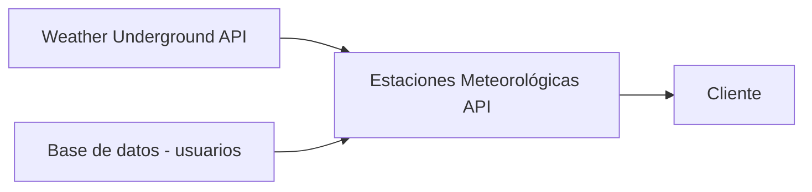

# Estaciones meteorológicas API

##	 Contenido

 - Proyecto
 - Diagrama de bloques
 - Software

## Proyecto

La finalidad del proyecto es implementar una aplicación capaz de obtener información de datos meteorológicos para posteriormente realizar un tratamiento sobre los datos y entregarlos cuando estos sean solicitados.

Adicional, debe ser capaz de informar a usuarios sobre fallas en las estaciones meteorológicas mediante un correo electrónico cuando se **detecte** que los datos no se han registrado en los últimos **30 minutos** o, se excedió el número de pedidos disponibles a la API de Weather Underground.

Por último, dada la hora de programación, la aplicación debe de realizar una captura de todos los datos obtenidos en el día a todos los usuarios que se encuentren subscritos a la página de la UniGrid - Uninorte ([http://estacionuninor.ddns.net:3001/](http://estacionuninor.ddns.net:3001/))

## Diagrama de bloques

## Software

**Backend** Nodejs 
**Database** MongoDB